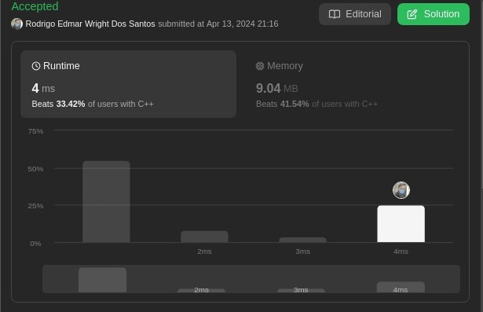

# LeetCode Problems

**Número da Lista**:  
**Conteúdo da Disciplina**: Grafos 1 

## Alunos
|Matrícula | Aluno |
| -- | -- |
| 20/0027158  |  Rodrigo Edmar Wright Dos Santos |
| 18/0113496  |  Guilherme de Oliveira Mendes |

## Sobre 
Neste projeto, será abordado alguns problemas disponíveis na plataforma [LeetCode](https://leetcode.com/) sobre grafos. Sendo que os problemas apresentados serão resolvidos utilizando conceitos apredidos em sala de aula.

## Screenshots
[Couples Holding Hands:](https://leetcode.com/problems/couples-holding-hands/description/) 

## Instalação 
**Linguagem**: C++ Python    
**Framework**: Não 
**Pré-requisito**: compilador de C++ e Compilador de Python.

## Uso 
Explique como usar seu projeto caso haja algum passo a passo após o comando de execução.

## Outros 
Quaisquer outras informações sobre seu projeto podem ser descritas abaixo.

