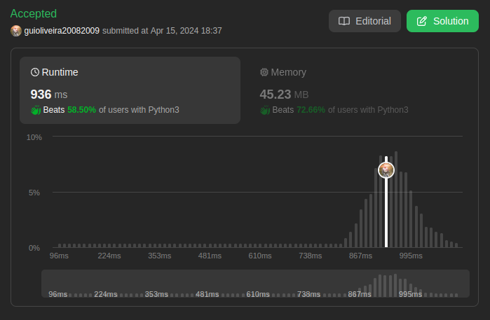

# LeetCode Problems

**Número da Lista**:  
**Conteúdo da Disciplina**: Grafos 1 

## Alunos
|Matrícula | Aluno |
| -- | -- |
| 20/0027158  |  Rodrigo Edmar Wright Dos Santos |
| 18/0113496  |  Guilherme de Oliveira Mendes |

## Sobre 
Neste projeto, será abordado alguns problemas disponíveis na plataforma [LeetCode](https://leetcode.com/) sobre grafos. Sendo que os problemas apresentados serão resolvidos utilizando conceitos apredidos em sala de aula.

## Screenshots
[Difícil: 765 Couples Holding Hands](https://leetcode.com/problems/couples-holding-hands/description/) 

[Difícil: 753 Cracking the Safe](https://leetcode.com/problems/cracking-the-safe/description/) 

[Média: 1319 Number of Operations to Make Network Connected](https://leetcode.com/problems/number-of-operations-to-make-network-connected/description/) 

[Média: 1466 Reorder Routes to Make All Paths Lead to the City Zero](https://leetcode.com/problems/reorder-routes-to-make-all-paths-lead-to-the-city-zero/description/) 

## Instalação 
**Linguagem**: C++ e Python3    
**Framework**: Não 
**Pré-requisito**: compilador de C++ e Compilador de Python3.
