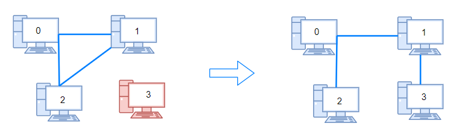
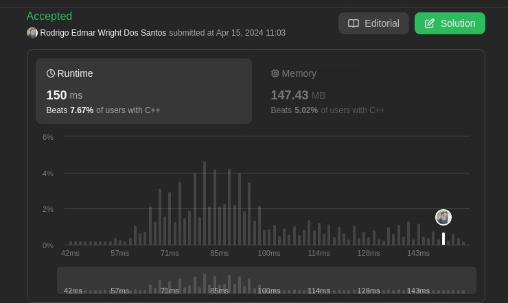
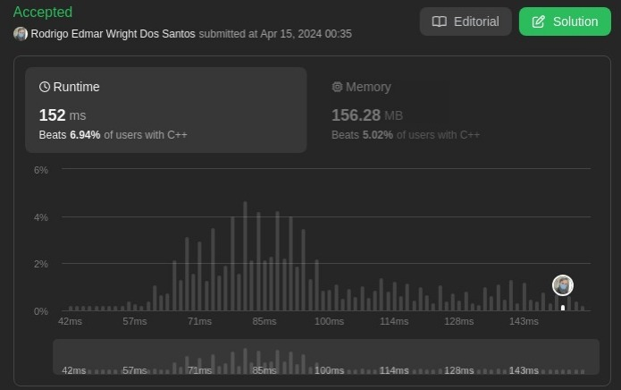

# 765. Couples Holding Hands

Problema: [Couples Holding Hands](https://leetcode.com/problems/couples-holding-hands/description/)

**Descrição:** <br>
There are n couples sitting in 2n seats arranged in a row and want to hold hands.

The people and seats are represented by an integer array row where row[i] is the ID of the person sitting in the ith seat. The couples are numbered in order, the first couple being (0, 1), the second couple being (2, 3), and so on with the last couple being (2n - 2, 2n - 1).

Return the minimum number of swaps so that every couple is sitting side by side. A swap consists of choosing any two people, then they stand up and switch seats.

**Example 1:**

Input: row = [0,2,1,3] <br>
Output: 1 <br>
Explanation: We only need to swap the second (row[1]) and third (row[2]) person. <br>

**Example 2:**

Input: row = [3,2,0,1] <br>
Output: 0 <br>
Explanation: All couples are already seated side by side. <br>

## Solução

Para este problema, será considerado cada par de elementos do vetor como um **vértice** no grafo. Sendo assim, para saber a qual casal o elemento pertence é só dividir por 2 (se par), ou subtrair 1 do elemento e depois dividir por 2 (se ímpar).

**Exemplo:**
```C++
if (row[i]%2 == 0)
    node->n1 = row[i]/2;
else node->n1 = (row[i])/2;
```
A Struct “couple” é composta por n1 e n2 (par de casal), prox1 e prox2 (para quem o n1 está apontando e para quem o n2 está apontando, seus casais), e por fim o booleano “used” (Define se o casal foi ou não usado na BFS).

**Struct couple:**
```C++
typedef struct couple{
   int n1;
   int n2;
   bool used;
   int prox1;
   int prox2;
} couple;
```
Para a construção das conexões do grafo, é varrido o vetor couples e se um dos elementos for igual, o prox correspondente apontará para a posição “i” do vetor.

**Criação das conexões:**
```C++
if (couples[j]->n1 == node->n1){
    couples[j]->prox1 = i;
    node->prox1 = j;
} else if (couples[j]->n2 == node->n1){
    couples[j]->prox2 = i;
    node->prox1 = j;
}
```


Depois de criado o grafo Couples, é feito uma BFS a partir de um vértice qualquer ainda não usado. Nessa BFS, terá um inteiro “counter” que conta quantas vezes uma aresta é adicionada. Sendo que, o resultado desse “counter” representa a quantidade de arestas na árvore, e também representa a quantidade mínima de swaps que deverá ser feita para colocar todos os elementos juntos com seus casais.

Por fim, é feita uma chamada recursiva na BFS, para garantir que todas as árvores foram contadas.

**Submissão:**<br>


# 753. Cracking the Safe

Problema: [Cracking the Safe](https://leetcode.com/problems/cracking-the-safe/description/)

**Descrição:** <br>
There is a safe protected by a password. The password is a sequence of n digits where each digit can be in the range [0, k - 1].<br>

The safe has a peculiar way of checking the password. When you enter in a sequence, it checks the most recent n digits that were entered each time you type a digit.<br>

For example, the correct password is "345" and you enter in "012345":<br>

After typing 0, the most recent 3 digits is "0", which is incorrect.<br>

After typing 1, the most recent 3 digits is "01", which is incorrect.<br>

After typing 2, the most recent 3 digits is "012", which is incorrect.<br>

After typing 3, the most recent 3 digits is "123", which is incorrect.<br>

After typing 4, the most recent 3 digits is "234", which is incorrect.<br>

After typing 5, the most recent 3 digits is "345", which is correct and the safe unlocks.<br>

Return any string of minimum length that will unlock the safe at some point of entering it.<br>

**Example 1:**

Input: n = 1, k = 2<br>

Output: "10"<br>

Explanation: The password is a single digit, so enter each digit. "01" would also unlock the safe.<br>

**Example 2:**

Input: n = 2, k = 2<br>

Output: "01100"<br>

Explanation: For each possible password:<br>
- "00" is typed in starting from the 4th digit.<br>

- "01" is typed in starting from the 1st digit.<br>

- "10" is typed in starting from the 3rd digit.<br>

- "11" is typed in starting from the 2nd digit.<br>

Thus "01100" will unlock the safe. "10011", and "11001" would also unlock the safe.<br>


## Solução

Para este problema, será considerado cada dígito do cofre como um **vértice** de um grafo. Dessa forma é possível saber qual a string que testa o máximo de possíbilidades com menor tamanho usando uma **Busca de Profundidade (DFS)** comparando os últimos n números da string com cada uma das possibilidades de resposta. 

**Exemplo:**

Usando o exemplo 2 acima: 
- O código sempre vai começar com 0, como a senha é de 2 números ela pula e adiciona outro 0 na string 
- Como o  valor atual da string é 00 e como essa é a primeira string vista na resposta ela adiciona os dois últimos dígitos da string no final da string resposta com ela ficando: 00
- Após isso ela pode adicionar 0 ou 1 caso ela adicione 0 a string vai ficar 000 e ao comparar os 2 últimos digitos da string resposta vai ver que já tem 00 e então vai voltar para o nó antigo
-  E depois  este vai para 1 e como 01 não foi visto ele adiciona o 1 no final da string resposta ficando: 001
- Após isso é colocado outro 1 na string e como 11 aparece pela primeira vez outro 1 é adicionado na string resposta ficando: 0011
- Após isso um 0 é adicionado na string como 10 não foi visto até agora 0 é adicionado na string resposta com está ficando : 00110


**Submissão:**<br>


# 1319. Number of Operations to Make Network Connected

Problema: [Number of Operations to Make Network Connected](https://leetcode.com/problems/number-of-operations-to-make-network-connected/description/)

**Descrição:**

There are n computers numbered from 0 to n - 1 connected by ethernet cables connections forming a network where connections[i] = [ai, bi] represents a connection between computers ai and bi. Any computer can reach any other computer directly or indirectly through the network.

You are given an initial computer network connections. You can extract certain cables between two directly connected computers, and place them between any pair of disconnected computers to make them directly connected.

Return the minimum number of times you need to do this in order to make all the computers connected. If it is not possible, return -1.

**Example 1:**



**Input:** n = 4, connections = [[0,1],[0,2],[1,2]] <br>
**Output:** 1 <br>
**Explanation:** Remove cable between computer 1 and 2 and place between computers 1 and 3. <br>

## Solução

Para resolver este problema, primeiramente deve-se construir um grafo a partir dos dados fornecidos. Sendo assim, foi construída uma estrutura de dados chamada **node** que possui os parâmetros:

point: para onde a posição está apontando
used: se a posição já foi usada ou não (só vale para a primeira posição da lista de cada posição no vetor).
 next: próxima posição na lista encadeada (outro vizinho).

Depois disso, foi criado um vetor de node chamado **network** que guardará o grafo do problema. Para a criação desse vetor foi usada a seguinte estrutura:

```C++
for (int i = 0; i < connections.size(); i++){
    node *new1 = (node*)malloc(sizeof(node));
    new1->point = connections[i][1];
    new1->used = false;
    new1->next = network[connections[i][0]];       
    network[connections[i][0]] = new1;


    node *new2 = (node*)malloc(sizeof(node));
    new2->point = connections[i][0];
    new2->used = false;
    new2->next = network[connections[i][1]];       
    network[connections[i][1]] = new2;  
}
```

Criado o grafo, agora é possível fazer uma DFS (Deep first Search) ou BFS (Broad Firs Search) para contar a quantidade de árvores soltas no grafo. Isso porque, a quantidade de swaps de cabos de rede que serão necessários para conectar toda a estrutura é igual a quantidade de componentes presentes no grafo. Sendo assim, para este problema foi usado primariamente uma BFS, no entanto posteriormente essa BFS foi trocada por uma DFS em busca de conseguir um melhor resultado (não houve visto que a complexidade de ambas é a mesma).

Na DFS usada não foi usada a recursão (BackTracking). Isso porque alguns dos casos de teste possuíam mais de 49000 computadores com outras milhares de conexões entre eles. Esses casos teste geraram árvores muito grandes, que quando aplicava-se a DFS recursiva estourava a capacidade de memória disponível para recursão. Consequentemente foi usada uma DFS não recursiva, que aproveita uma lista de inteiros **S** para marcar os passos.

**DFS**
```C++
vector<int>S;
void DFS (vector<node*> network, int visited){    
   S.push_back(visited);  
   while (S.empty() == false){
       visited = S.back();
       S.pop_back();
       network[visited]->used = true;
       node *computer = network[visited];
       while (computer != NULL){
           if (network[computer->point]->used == false){
               S.push_back(computer->point);
           }
           computer = computer->next;      
       }
   }
  
   return;
}
```

**Submissão:**

**DFS:**



**BFS:**


